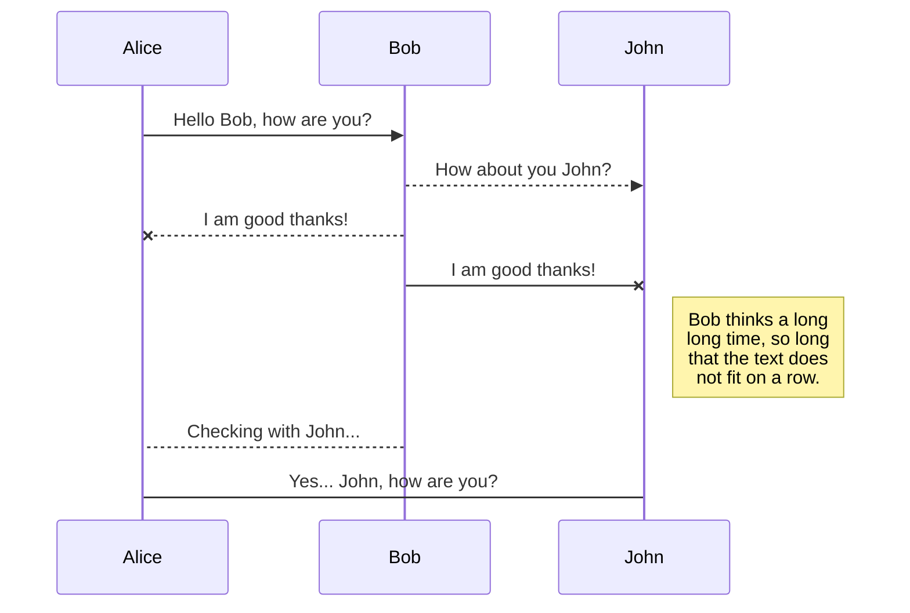
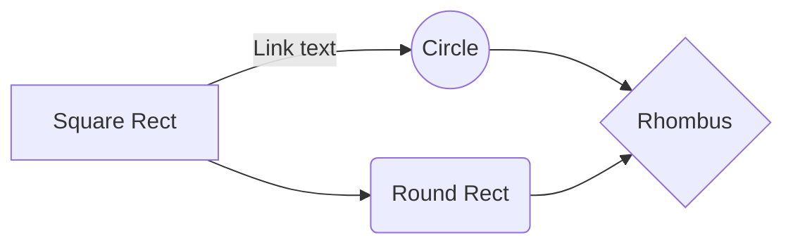

# Theme

Theme contain static design token values, that are constant of your design, like all font-familiy names, all font size values, all color codes used, and so on..

Theme need also a **method** to convert these static design token into CSS.
Box for each prop call **theme.CONVERT_UI_PROP(propName, propValue)**, that convert a Design Token Values ( i.e. "primary" for backgroundColor ) into printable CSS value ( i.e. "#67df3s" )

> ##### Theme - Static Design Token
>
> ```
> const theme = {
>   BP : {} // Breakpoints, provide token for media queries declaration
>   COLORS: {} // contain color codes
>   FONTS: {} // contain all fontFamily "string" used in design.
> }
> ```

# UI object

useUI take care of inject style in Box.
Box take care of converting values, if needed, and print CSS in DOM.

The power of this system is theme object.

# Let's build some Components...

Said that we are simulating you're using all the packages...

#### Badge ( a Component with static style )

This Badge is static,
We simply spread the **UI** object in the **Box** component.
We don't need "useUI" at all, because our UI is not derived from state/props.

```javascript
import React from "react";
import { Box } from "@tresorama/use-ui";

// build UI object!!
const UI = {
  // special
  TYPO: "badge", // more on this later ...
  PRESETS: "rounded", // more on this later ...
  // common
  paddingX: 1,
  paddingY: 0.5,
  borderColor: "primary",
  backgroundColor: "primary=>setAlpha(0.2)", // more on this later ...
};

// React Component that use Box as a "span"
const Badge = (props) => {
  return <Box as="span" {...UI} {...props} />;
};

export default Badge;
```

###### playground version

```javascript
import React from "react";
import { Box } from "@tresorama/use-ui";

// React Component that use Box as a "span"
const Badge = (props) => {
  return (
    <Box
      as="span"
      TYPO="badge"
      PRESETS="rounded"
      paddingX={1}
      paddingY={0.5}
      borderColor="primary"
      backgroundColor="primary=>setAlpha(0.2)"
      {...props}
    />
  );
};

export default Badge;
```

### Stack ( a Component with dynamic props )

We want a Stack component to be used like this :

```javascript
<Stack direction="column" gutter={4}>
  <Button>
  <Text>
</Stack>
```

or

```javascript
const UI = {
	// Stack API
	direction: 'column',
	gutter: 4,
}

//....


<Stack {...UI}>
  <Button>
  <Text>
</Stack>
```

So we want a place where define a Stack API, with default values.
And also a place where we parse "props" against Stack API and build a UI object.

```javascript
import React from "react";
import { Box, useUI } from "#tresorma/use-ui";

// build the UI object
const sheet = {
  // define/parse the Stack API.
  customAPI: (props) => ({
    direction: props.direction || "row", // 'row' | 'column'
    gutter: props.gutter || 0, // <Number>
  }),

  // consume the Stack API and return UI object.
  runner: (_) => ({
    display: "flex",
    flexDirection: _.direction,
    "& > * + *": {
      [`margin${_.direction === "row" ? "Left" : "Top"}`]: _.gutter
        ? _.gutter
        : undefined,
    },
  }),
};

const Stack = (props) => {
  //on every re-render of React re-build the "UI" object based on "props" that are changed.
  const [UI, propsCleaned] = useUI(sheet, props, []);

  // spread the UI object in <Box>.
  return <Box {...UI} {...propsCleaned} />;
};

export default Stack;
```

## Let's break it down ...

On every "Stack" component re-render phase we build a UI object by calling **_useUI_**.
Then we spread it to Box.

```javascript
const [UI, propsCleaned] = useUI(sheet, props,[]);
return <Box as="span" {...UI} {...propsCleaned} >;
```

## sheet

Shape :

```javascript
const sheet = {
  customAPI: (props) => ({}), // => must return an {}
  runner: (_) => ({}), // => must return an {}
};
```

> **"sheet"** object can be named as you prefer. It's just an object with two function properties.
> **"customAPI"** is **required** , and name can't be changed.
> **"runner"** is **required** , and name can't be changed.

Example:

```javascript
const sheet = {
  customAPI: props => ({
    color: props.color || "black",
  }),
  runner: _ => ({
    color: `${_.color}=>setAlpha(0.5)`,
    borderColor: _.color,
    padding: 2
  }),
};

// later in component ..
const Component = props => {
  const [UI] = useUI(sheet, props);
  return <Box {...UI} >
}
```

How it works :

When useUI is called , it pass "props" to **sheet.customAPI**, that search in props for API properties and parse them into an object.
This object is later passed to **sheet.runner** that build the UI object.

**REMEMBER:**

> Every props you need in the "runner" must be defined in "customAPI", along with their "default" values.

# propsCleaned

Let's say our UI Component provide a custom API "color" prop, inside his UI builder sheet.

> **NOTE :** some lines are changed , hinted by comments.

```javascript
import React from "react";
import { Box, useUI } from "@tresorma/use-ui";

const sheet = {
  customAPI: props => ({
    color: props.color || "black",
  }),
  runner: _ => ({
    color: `${_.color}=>setAlpha(0.5)`,
    borderColor: _.color,
    padding: ...
  }),
};

const Button = props => {
  const [UI] = useUI(sheet, props); // NOTE that this line is changed
  return <Box {...UI} {...props} />; // NOTE that this line is changed
};

export default Button;
```

... and we consume Button like this

```javascript
const ConsumerOfUIComponents = () => {
  const handleClick = () => alert("ciao");
  return (
    <Box>
      <Button color="primary" onClick={handleClick}>
        Click Me
      </Button>
    </Box>
  );
};
```

In Button, we receive :

```javascript
props = {
  color: 'primary',
  onClick: ... ,
}
```

... then we build UI object , that results in :

```javascript
UI = {
  color: "primary=>setAlpha(0.5)",
  borderColor: "primary",
};
```

... and spread both `UI` and `props` :

```javascript
return <Box {...UI} {...props} />;
```

If we spread `props` after spreading `UI`, Box will receive ` color = 'primary'` instead of `color = 'primary=>setAlpha(0.5)`.

So we use this form :

```javascript
const [UI, propsCleaned] = useUI(sheet, props, []);
return <Box {...UI} {...propsCleaned} />;
```

.. where `propsCleaned = { onClick: ... }` does not contain any "color" prop, so it won't be overridden.

# Build a Complex Dynamic UI Component

#### Button

We provide a **customAPI** with :

- "shape" that can be 'text', 'contained' , or 'outline' , default to 'text',
- "color", that we use as base color for manipulation, default to 'black'

```javascript
import React from "react";
import { Box, useUI } from "@tresorama/use-ui";

const sheet = {
  customAPI: (props) => ({
    shape: props.shape || "text",
    color: props.color || "black",
  }),
  runner: (_) => ({
    buttonWrapper: {
      //special
      TYPO: "button", // skipp this for now ...
      PRESETS: "transition_Buttons", // skip this for now ...
      // common
      border: "1px solid transparent",
      backgroundColor: "transparent",
      borderRadius: "5px",
      overflow: "hidden",
      position: "relative",
      paddingY: 1.5,
      paddingX: 2,
      display: "inline-block",
      transitionProperty: "background-color, color, borderColor",

      ...("text" === _.shape && {
        backgroundColor: "transparent",
        color: _.color,
        "&:hover": {
          backgroundColor: `${_.color}=>setAlpha(0.08)`,
        },
      }),

      ...("outline" === _.shape && {
        backgroundColor: "transparent",
        color: _.color,
        borderColor: `${_.color}=>setAlpha(0.5)`,
        "&:hover": {
          backgroundColor: `${_.color}=>setAlpha(0.08)`,
          borderColor: _.color,
        },
      }),

      ...("contained" === _.shape && {
        borderColor: "transparent",
        backgroundColor: _.color,
        color: `${_.color}=>contrastTextColor()`,
        "&:hover": {
          backgroundColor: `${_.color}=>darken()`,
        },
      }),
    },
    buttonContent: {
      // common
      display: "flex",
      justifyContent: "center",
      alignItems: "center",
      pointerEvents: "none",
    },
  }),
};

const Button = ({ children, ...props }) => {
  const [UI, propsCleaned] = useUI(sheet, props, []);

  return (
    <Box {...UI.buttonWrapper} {...propsCleaned}>
      <Box {...UI.buttonContent}>{children}</Box>
    </Box>
  );
};

export default Button;
```

The beauty of this "customAPI" is that for any given "color" it calculate borderColor, backgroundColor with color manipulation, letting us to change only one prop to change the all "color scheme" of the button.

# Box

Because we always use Box to render DOM elements, is Box that is able to accept CSS values.

# Box API

`<Box>` can accept these props:

- any CSS property, key camelCased,
- TYPO ,
- PRESETS

## Box API - CSS props

```javascript
<Box marginTop="10px" backgroundColor="rgb(40,60,80)" >
```

Do the same with any CSS property. Values in string.

If used with defaultTheme, some "chosen" CSS props can also accept special values, instead of regular css values.
See all of them below.

# THEME.COLOR

Values of these CSS props:

`color`
`backgroundColor`
`borderColor`

can be :

- ` (string) rgb | rgba | hsl | hsla | hex | name` - color values
- ` (string) "key"` provided in THEME.COLOR.
- ` (string)`one of the first two , followed by `=>`,and one or more method name divided by `+`

# THEME.COLOR METHODS

Syntax :

```javascript
"colorCode=>method1()+method2()";
```

Examples:

```javascript
"#457856=>darken(10)+setAlpha(0.8)";
"primary=>darken(10)+setAlpha(0.8)";
```

Methods List:

- All method provided by [TinyColor2]() :
- contrastText()

# THEME.TRANSITION

Properties :

`transitionDuration`
`transitionDelay`
`transitionTimingFunction`

Example:

```javascript
// when declearing THEME ...
const THEME = {
  //...
  TRANSITION: {
    transitionDuration: {
      SHORT: 400,
      LONG: 1200,
    },
    transitionTiming: {
      ONE: 'ease-in-out',
    },
  },
};

// when using Box ...
<Box
  transitionDuration="SHORT"
  transitionDelay="LONG"
  transitionTimingFunction="ONE"
>
```

```css
  transition-duration: 400ms,
  transition-delay: 1200ms,
  transition-timing-function: ease-in-out
```

# THEME.SIZE

Properties:

`padding`
`paddingTop, Left, Right, Bottom`
`paddingX`
`paddingY`
`margin`
`marginTop, Left, Right, Bottom`
`marginX`
`marginY`

can be :

- `(Number)` - that will be multiplied by THEME.SIZE.base Number
- ` (string) any "css" valid size value`
  Example:

```javascript
// when declearing THEME ...
const THEME = {
  //...
  SIZE: {
    base: 8, // 8 px
  },
};

// when using Box ...
<Box
  marginTop={2}
  paddingX={4}
>
```

```css
  margin-top: 16px, /* 8x2 */
  padding-left: 32px,/* 8x4 */
  padding-right: 32px,/* 8x4 */
```

# THEME.FONT

Properties:

`fontFamily`

can be :

- ` (Number) "index"` in the THEME.FONTS.fonts array, starting from 1
- ` (string) any "css" valid fontFamily value`

Example :

```javascript
// when declearing THEME ...
const THEME = {
  //...
  FONT: {
    fonts: [
      "Helvetica, Roboto, sans-serif",
      "Roboto, Avenir, serif",
    ],
  },
};

// when using Box ...
<Box
  fontFamily={2}
>
```

```css
font-family: Roboto, Avenir, serif;
```

> **NOTE** index are huminzed, it begin with 1 , not 0.

# THEME.TEXT

Values of these CSS props:

`fontSize`

can be :

- ` (string) "key"` in the THEME.TEXT
- ` (string) any "css" valid fontSize value`

Example :

```javascript
// when declearing THEME ...
const THEME = {
  //...
  TEXT: {
    xs: "16px",
    sm: "12px",
    md: "16px",
    lg: "20px",
    xl: "32px",
    "2xl": "48px",
    "3xl": "64px",
  },
};

// when using Box ...
<Box
  fontSize="lg"
>
```

```css
font-size: 20px;
```

# THEME.TYPO

Any Box component can receive "TYPO" prop.
Multiple values are not allowed.

Example :

```javascript
// when declearing THEME ...
const THEME = {
  //...
  TYPO: {
    button: {
      fontSize: "sm",
      fontFamily: 2,
      lineHeight: "1.5",
      letterSpacing "0.025",
    },
    heading1: {
      fontSize: "3xl",
      fontFamily: 1,
      lineHeight: "1.8",
      fontWeight: "700"
    },
  },
};

// when using Box ...
<Box
  TYPO="heading1"
>
```

```css
font-size: 64px;
font-family: Helvetica, Roboto, sans-serif;
line-height: 1.8;
font-weight: 700;
```

# THEME.PRESETS

Any Box component can receive a special "PRESETS" prop.
Multiple value allowed with Array Syntax.

Base Syntax :

```javascript
<Box
  PRESETS="presetName"
>
```

Array Syntax :

```javascript
<Box
  PRESETS={["presetName", "secondPresetName"]}
>
```

Example :

```javascript
// when declearing THEME ...
const THEME = {
  //...
  PRESETS: {
    roundedCorners: {
      borderRadius: 1,
      overflow: 'hidden',
    },
    avatar: {
      borderRadius: "50%",
      overflow: 'hidden',
    },
    transitions_Button : {
      transitionDuration: "SHORT"
      transitionDelay: "LONG",
      transitionTimingFunction: "ONE"
  },
};

// when using Box ...
<Box
  PRESETS={["transitions_Button", "avatar"]}
>
```

```css
  transition-duration: 400ms;
  transition-delay: 1200ms;
  transition-timing-function: ease-in-out;
  border-radius: 50%,
  overflow: hidden;
```

# How Style guide values are accessed ?

Good products passes a Design phase, and then a code implementation phase.

How much margin is ok on this component ?
How many pixel of fontSize this text need, to be consistent in the overall page ?
How much borderRadius ...?
What color code ...?

All of this decision are question related to UI Design process, not the implementation of the Design through code.

Usually, after the Design phase , designer give developer something like this, to implement:

```javascript
button: {
  fontSize: "32px",
  color: "#764532",
  marginTop: "12px",
  lineHeight: "1.5",
  fontWeight: '700',
```

What if designer give something like this:

```javascript
button: {
  fontSize: "lg",
  color: "primary",
  marginTop: 1.5,
  lineHeight: "1.5",
  fontWeight: '700',
  ...
}
```

# Where these "values" came from ?

From our constitution, the **Style Guide**.

# How we convert these "values" ?

When attempting to convert CSS props, **_use-ui_** , for each individual CSS property ( i.e. borderColor, fontSize, ... ) call a **THEME.CONVERTERS** method called **getConverterFunction** with css prop name as argument.

The logic inside **getConverterFunction** return a converter function based on the name of the CSS prop, that will then really convert `borderRadius: 2` to `borderRadius: '16px'`.

We decide which CSS props maps to which converter, and also how conversion is made inside the converter, so these CONVERTERS are customizable.

Further details on customization are in the [Customize Converters](https://www.example.com/my%20great%20page) section.

## Provided THEME

In style guide we define, a **"base"** pixel **SIZE** ( like 8 px ), and when we defining a **_"marginTop"_** property we define a Number as value, that number will be multiplied by base size.

```javascript
marginTop: 1.5, // 1.5 * 8 => 12px
```

In style guide we define , in t-shirt scale, **TEXT** size dimensions as "sm", "md", "lg", and when we defining a **_"fontSize"_** property we define a "t-shirt key" as value.

```javascript
fontSize: "lg",
```

In style guide we define , **COLORS** with "labels", like "primary", "secondary", "success", "black", ... and when we defining a **_"color"_** or **_"backgroundColor"_** property we define a "label" value, or as bonus feature a "methods string" that will produce our final color code.

```javascript
color: "primary",
borderColor: "primary=>darken(20)+setAlpha(0.6)"
```

Ok, cool, but so when we decide to update the design we need to edit Components individually?

Using the power of code, we define , in **Style guide**, some sort of presets of rules that, when we are implementing component, recall like this:

```javascript
// in THEME ( Style Guide ) we define the rules set ...
const THEME = {
  // ...
  TYPO: {
    button: {
      fontSize: 'lg',
      lineHeight: "1.5",
      fontWeight: '700',
    },
  // ...
}

// in UI definition of button...

  //...
  TYPO: "button",
  // ...
```

### **If our constitution change, we update the constitution, not the component.**

When we need to update a **TYPO** rules set, we change them in **THEME**, without need to access the individual component.

We utilize the same approach for other "difficult to remember" set of properties.

Let's say that our Card, Button, IconButton, uses the same borderRadius value :
` borderRadius: 2`

Instead of defining `borderRadius: 2 ` at component level, we create a **PRESET** called "rounded" in **THEME**:

```javascript
// in THEME ( Style Guide ) ...
const THEME : {
  // ...
  TYPO: // ...,
  PRESETS: {
    rounded: {
      borderRadius: 2,
      overflow: 'hidden',
    },
  },
}
```

... and recall it in Components:

```javascript
// in Card ...

// ...
PRESETS: "rounded",
//...

// in Button ...

// ...
PRESETS: "rounded",
//...

// in IconButton ...

// ...
PRESETS: "rounded",
//...
```

And if we want more **PRESETS** ??? Use array :

```javascript
// in THEME ...
  PRESETS: {
    rounded : {
      borderRadius: 2,
      overflow: 'hidden',
    },
    shadow: {
      boxShadow: "0vh 0vh 10px 0px rgba(0,0,0,0.35)",
    }


// in Card | button | IconButton ...
// ...
PRESETS: ["rounded", "shadow"]
//...
```

# Our Interpretation

Let s see the usage...

## Build a Atom Components of Your UI Library

```javascript
// We build a Badge component.

import React from "react";
import { Box } from "@tresorama/use-ui";

const UI = {
  wrapper: {
    // special
    TYPO: "badge",
    PRESETS: "rounded",
    // common
    paddingX: 1,
    paddingY: 0.5,
    backgroundColor: "primary=>setAlpha(0.2)",
  },
};
const Badge = props => {
  return <Box as="span" {...UI.wrapper} {...props} />;
};
export default Badge;

/* ===================================================
		SPIEGAIONE
=================================================== */
// badge component
const UI = {
  wrapper: {
    // special...
    //----------------------------------------

    TYPO: "badge",
    // THEME typography "desig token" object, with text CSS properties for "badge"
    PRESETS: "rounded",
    // THEME custom CSS preset  "desig token" object, in practice is a preset of CSS borderRadius (THEME)

    // common...
    // -----------------------------------------

    paddingX: 1, // will be multiplied with a "arbitrary pixel value" (THEME)
    paddingY: 0.5, // same thing ...
    // or
    paddingY: (() => 1 / 2)(), // if dont like multiply...

    backgroundColor: "primary=>setAlpha(0.2)",
    // color with manipulation connected, later we'll see why...
  },
};
const Badge = props => {
  return <Box as="span" {...UI.wrapper} {...props} />;
};
export default Badge;
```

## Build a more complex Atom Components

```javascript
// We build a Stack component with "gutter" and "direction" props

import React from "react";
import { Box, useUI } from "#tresorma/use-ui";

const sheet = {
  customAPI: (props) => ({
    direction: props.direction || "row", // 'row' | 'column'
    gutter: props.gutter || 0, // <Number>
  }),
  runner: (_) => ({
    wrapper: {
      display: "flex",
      flexDirection: _.direction,
      "& > * + *": {
        [`margin${_.direction === "row" ? "Left" : "Top"}`]: _.gutter
          ? _.gutter
          : undefined,
      },
    },
  }),
};
const Stack = (props) => {
  const [UI, propsCleaned] = useUI(sheet, props, []);
  return <Box {...UI.wrapper} {...propsCleaned} />;
};

export default Stack;
```

**OK**, let's clearify some new code that appeared...

We are dealing with a Stack that we use like this:

```javascript
const UI = {
  pageContentStack: {
    // Stack custom API
    direction: "column",
    gutter: 4,
    // 4 * "whatever value" in THEME.SIZE, in px.
    // It is applied by <Stack> with marginTop or marginLeft on children..

    // common
    backgroundColor: "secondary",
    border: "1px solid",
    borderColor: "primary=>setAlpha(0.4)",
  },
};
const SomewhereInUI = () => {
  return (
    <>
      {/*...*/}
      {/*...*/}
      <Stack {...UI.pageContentStack}>
        {/*...*/}
        {/*...*/}
      </Stack>
      {/*...*/}
      {/*...*/}
    </>
  );
};
```

So our Stack must provide an API with "direction" and "gutter".
This is exactly what we've done in .. :

```javascript
// in Stack.js

const sheet = {
  customAPI: props => ({
    direction: props.direction || "row", // 'row' | 'column'
    gutter: props.gutter || 0, // <Number>
  }),
  runner: ...
};
```

We defined also default values ... in one place.
And the object created by **sheet.customAPI** will be passed to **sheet.runner** so we can use the "Stack API" props and convert in CSS.

```javascript
const sheet = {
  customAPI: ...
  runner: _ => ({
    display: "flex",
    flexDirection: _.direction,
    "& > * + *": {
      [`margin${_.direction === "row" ? "Left" : "Top"}`]: _.gutter ? _.gutter : undefined,
    },
  }),
};
```

Finally when Stack is mounted we call customApi and runner to build "UI" object.

```javascript
const Stack = (props) => {
  // buildin the UI object...
  const [UI, propsCleaned] = (sheet, props, []);
  // propsCleaned is props without sheet.customAPI props, so you don't spread down props of the UI.
  return <Box {...UI} {...propsCleaned} />;
};
```

## Theme provided

In Theme we have all of source of truth about UI:

- BP (breakpoint) : min-width value of Bootstrap breakpoints scale.Used to print media queries for any CSS props/selector.
- COLORS: we have "semantic" color, or any other color namig you use, we later use these colors as base for manipulation while defining CSS rules about color.
- FONTS: list of font-family, we can print a specific font by his index in the list (index humanized)
- TEXT: (text-size values) in "t-shirt" scale ("xs""sm""md""lg""xl""2xl") , so we use "2xl" or "xs" as value in fontSize props on components.
- TYPO: (typography rules set) for easy design maintenance we define here every props related to typography for sementic texts , like heading1, heading2, badge, button, ...
- TRANSITION: we hate when we need to remember how many ms we set on other component , so we define here a set of some preset with all time related css transition props, plus an other set of presets for timing function.
- PRESETS: generic grouped css rules set we want being consistent between components.

- The file synchronization will keep one file of the workspace synced with one or multiple files in **Google Drive**, **Dropbox** or **GitHub**.
  > Before starting to sync files, you must link an account in the **Synchronize** sub-menu.

```javascript
// BREAKPOINTS (MIN WIDTH)...
const BP = {
  xs: "0px",
  sm: "600px",
  md: "960px",
  lg: "1280px",
  xl: "1920px",
};
// SPACING SIZES ...
const SIZE = {
  base: 8, // 8 px
};

// COLORS ...
const BRAND_COLORS = {
  brand1: "#4dabf5",
  brand2: "#1769aa",
  brand2ContrastText: "white",
  brand3Light: "#f73378",
  brand3Dark: "green=>darken()",
  //
};
const COMMON_PALETTE = {
  coral: "coral",
  yellow: "rgb(255 255 0)",
  red: "rgb(255 0 0)",
  orange: "rgb(255 165 0)",
  green: "green",
  white: "#ededed",
  black: "rgba(0, 0, 0, 1)",
  // egggradients
  orangeBasicIncome: "#ff928b",
  orangeBasicIncome2: "#ffac81",
  blueAdeleFirstLove: "#009ffd",
  blueAdeleFirstLove2: "#2a2a72",
};
const COLOR = {
  ...COMMON_PALETTE,
  primary: COMMON_PALETTE.orangeBasicIncome,
  primaryContrastText: BRAND_COLORS.brand2ContrastText,
  //
  secondary: COMMON_PALETTE.blueAdeleFirstLove2,
  secondaryContrastText: COMMON_PALETTE.white,

  success: COMMON_PALETTE.green,
  warning: COMMON_PALETTE.red,
};

// FONT FAMILIES ...
const FONT = {
  fonts: [
    "Arial, serif",
    "Avenir, serif",
    '"Roboto", "Helvetica", "Arial", sans-serif',
  ],
};

// TEXT SIZES ...
const TEXT = {
  xs: "10px",
  sm: "12px",
  md: "16px",
  lg: "20px",
  xl: "32px",
  "2xl": "48px",
  "3xl": "64px",
  options: {
    convertToRem: true,
  },
};

// TYPOGRAPHY STYLES ...
const TYPO = {
  mainNavItem: {
    fontFamily: 2,
    fontSize: "md",
    fontWeight: "400",
    textDecoration: "underline",
    textUnderlineOffset: "0.2em",
    // textTransform: "uppercase",
  },
  mainNavMobileItem: {
    fontFamily: 3,
    fontSize: "2xl",
    fontWeight: "700",
    textTransform: "capitalize",
    textDecoration: "underline",
  },
  button: {
    fontFamily: 2,
    fontSize: "sm",
    fontWeight: "700",
    textTransform: "uppercase",
    //
    // from material UI button
    lineHeight: "1",
    letterSpacing: "0.02857em",
    // transition: "background-color 250ms cubic-bezier(0.4, 0, 0.2, 1) 0ms,box-shadow 250ms cubic-bezier(0.4, 0, 0.2, 1) 0ms,border 250ms cubic-bezier(0.4, 0, 0.2, 1) 0ms",
    // fontFamily: ,
  },
  badge: {
    fontFamily: 2,
    fontSize: "xs",
    fontWeight: "100",
    textTransform: "uppercase",
  },
  heading1: {
    fontFamily: 2,
    fontSize: "2xl",
    fontWeight: "700",
    lineHeight: "1.2",
    // textTransform: "uppercase",
  },
  heading2: {
    fontFamily: 2,
    fontSize: "xl",
    fontWeight: "800",
    // textTransform: "uppercase",
  },
  heading3: {
    fontFamily: 2,
    fontSize: "lg",
    fontWeight: "700",
    // textTransform: "uppercase",
  },
  heading4: {
    fontFamily: 2,
    fontSize: "md",
    fontWeight: "700",
    // textTransform: "uppercase",
  },
  heading5: {
    fontFamily: 2,
    fontSize: "sm",
    fontWeight: "700",
    // textTransform: "uppercase",
  },
  heading6: {
    fontFamily: 2,
    fontSize: "xs",
    fontWeight: "700",
    // textTransform: "uppercase",
  },
  body: {
    fontFamily: 2,
    fontSize: "md",
    fontWeight: "100",
  },
};

const TRANSITION = {
  transitionDuration: {
    SHORT: 400,
  },
  transitionTimingFunction: {
    ONE: "cubic-bezier(0.4, 0, 0.2, 1)",
  },
};

// SPECIAL CSS-SNIPPET FOR CONSISTENT UI ...
const PRESETS = {
  rounded: {
    borderRadius: 1,
    overflow: "hidden",
  },
  boxShadow: {
    boxShadow: "0vh 0vh 10px 0px rgba(0,0,0,0.35)",
  },
  textBorderWhite: {
    textShadow: "-1px -1px #fff, 1px -1px #fff, -1px 1px #fff, 1px 1px #fff",
  },
  textBorderBlack: {
    textShadow: "-1px -1px #000, 1px -1px #000, -1px 1px #000, 1px 1px #000",
  },
  transition_Buttons: {
    transitionDuration: "SHORT",
    transitionTimingFunction: "ONE",
  },
};

const CONVERTERS = {
  getConverterFunction(cssPropKey) {
    let converter = null;
    const { MAP } = this;

    // get converter function for this CSS prop...
    for (const converterName in MAP) {
      if (Object.hasOwnProperty.call(MAP, converterName)) {
        // extract all prop name allowed with this converter ...
        const propsAllowed = MAP[converterName];
        // get convertert if this prop name is included ...
        if (inArray(propsAllowed, cssPropKey)) {
          converter = this[converterName];
          break;
        }
      }
    }
    if (!converter) converter = this.passDirectly;

    return converter;
  },
  MAP: {
    getSize: [
      "padding",
      "paddingX",
      "paddingY",
      "paddingTop",
      "paddingRight",
      "paddingBottom",
      "paddingLeft",
      "margin",
      "marginX",
      "marginY",
      "marginTop",
      "marginRight",
      "marginBottom",
      "marginLeft",
      "borderRadius",
    ],
    getTextSize: ["fontSize"],
    getColor: ["color", "backgroundColor", "borderColor"],
    getFontFamily: ["fontFamily"],
    getTransitionTime: ["transitionDuration", "transitionDelay"],
    getTransitionTimingFunction: ["transitionTimingFunction"],
  },
  passDirectly: (a) => String(a),
  getSize: (size, { SIZE: S }) => S.getSizeValue(size),
  getTextSize: (size, { TEXT: T }) => T.getFontSizeValue(size),
  getColor: (key, { COLOR: C }) => C.getColorValue(key),
  getFontFamily: (index, { FONT: F }) => F.getFontFamilyValue(index),
  getTransitionTime: (a, { TRANSITION: T }) => T.getTime(a),
  getTransitionTimingFunction: (a, { TRANSITION: T }) => T.getTiming(a),
};

const defaultTheme = {
  BP,
  SIZE,
  COLOR,
  FONT,
  TEXT,
  TYPO,
  PRESETS,
  TRANSITION,
  CONVERTERS,
};
```

## Delete a file

You can delete the current file by clicking the **Remove** button in the file explorer. The file will be moved into the **Trash** folder and automatically deleted after 7 days of inactivity.

## Export a file

You can export the current file by clicking **Export to disk** in the menu. You can choose to export the file as plain Markdown, as HTML using a Handlebars template or as a PDF.

# Synchronization

Synchronization is one of the biggest features of StackEdit. It enables you to synchronize any file in your workspace with other files stored in your **Google Drive**, your **Dropbox** and your **GitHub** accounts. This allows you to keep writing on other devices, collaborate with people you share the file with, integrate easily into your workflow... The synchronization mechanism takes place every minute in the background, downloading, merging, and uploading file modifications.

There are two types of synchronization and they can complement each other:

- The workspace synchronization will sync all your files, folders and settings automatically. This will allow you to fetch your workspace on any other device.

  > To start syncing your workspace, just sign in with Google in the menu.

- The file synchronization will keep one file of the workspace synced with one or multiple files in **Google Drive**, **Dropbox** or **GitHub**.
  > Before starting to sync files, you must link an account in the **Synchronize** sub-menu.

## Open a file

You can open a file from **Google Drive**, **Dropbox** or **GitHub** by opening the **Synchronize** sub-menu and clicking **Open from**. Once opened in the workspace, any modification in the file will be automatically synced.

## Save a file

You can save any file of the workspace to **Google Drive**, **Dropbox** or **GitHub** by opening the **Synchronize** sub-menu and clicking **Save on**. Even if a file in the workspace is already synced, you can save it to another location. StackEdit can sync one file with multiple locations and accounts.

## Synchronize a file

Once your file is linked to a synchronized location, StackEdit will periodically synchronize it by downloading/uploading any modification. A merge will be performed if necessary and conflicts will be resolved.

If you just have modified your file and you want to force syncing, click the **Synchronize now** button in the navigation bar.

> **Note:** The **Synchronize now** button is disabled if you have no file to synchronize.

## Manage file synchronization

Since one file can be synced with multiple locations, you can list and manage synchronized locations by clicking **File synchronization** in the **Synchronize** sub-menu. This allows you to list and remove synchronized locations that are linked to your file.

# Publication

Publishing in StackEdit makes it simple for you to publish online your files. Once you're happy with a file, you can publish it to different hosting platforms like **Blogger**, **Dropbox**, **Gist**, **GitHub**, **Google Drive**, **WordPress** and **Zendesk**. With [Handlebars templates](http://handlebarsjs.com/), you have full control over what you export.

> Before starting to publish, you must link an account in the **Publish** sub-menu.

## Publish a File

You can publish your file by opening the **Publish** sub-menu and by clicking **Publish to**. For some locations, you can choose between the following formats:

- Markdown: publish the Markdown text on a website that can interpret it (**GitHub** for instance),
- HTML: publish the file converted to HTML via a Handlebars template (on a blog for example).

## Update a publication

After publishing, StackEdit keeps your file linked to that publication which makes it easy for you to re-publish it. Once you have modified your file and you want to update your publication, click on the **Publish now** button in the navigation bar.

> **Note:** The **Publish now** button is disabled if your file has not been published yet.

## Manage file publication

Since one file can be published to multiple locations, you can list and manage publish locations by clicking **File publication** in the **Publish** sub-menu. This allows you to list and remove publication locations that are linked to your file.

# Markdown extensions

StackEdit extends the standard Markdown syntax by adding extra **Markdown extensions**, providing you with some nice features.

> **ProTip:** You can disable any **Markdown extension** in the **File properties** dialog.

## SmartyPants

SmartyPants converts ASCII punctuation characters into "smart" typographic punctuation HTML entities. For example:

|                  | ASCII                           | HTML                          |
| ---------------- | ------------------------------- | ----------------------------- |
| Single backticks | `'Isn't this fun?'`             | 'Isn't this fun?'             |
| Quotes           | `"Isn't this fun?"`             | "Isn't this fun?"             |
| Dashes           | `-- is en-dash, --- is em-dash` | -- is en-dash, --- is em-dash |

## KaTeX

You can render LaTeX mathematical expressions using [KaTeX](https://khan.github.io/KaTeX/):

The _Gamma function_ satisfying $\Gamma(n) = (n-1)!\quad\forall n\in\mathbb N$ is via the Euler integral

$$
\Gamma(z) = \int_0^\infty t^{z-1}e^{-t}dt\,.
$$

> You can find more information about **LaTeX** mathematical expressions [here](http://meta.math.stackexchange.com/questions/5020/mathjax-basic-tutorial-and-quick-reference).

## UML diagrams

You can render UML diagrams using [Mermaid](https://mermaidjs.github.io/). For example, this will produce a sequence diagram:



And this will produce a flow chart:


